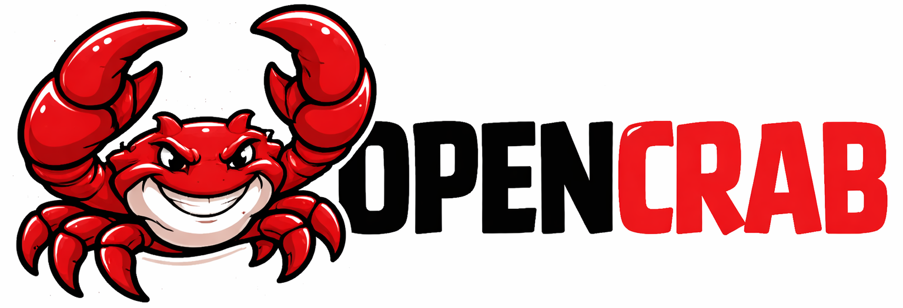

# OpenCrab

<p align="center">
  
</p>

**Self-distilling Learning Framework for AI Chatbots and Agents**

> *The more you use it, the more it knows you.*

OpenCrab captures your AI conversations, analyzes them for mistakes using frontier models, and distills that knowledge into a local model that improves over time.

## Mixture of Models

General AI models are powerful but generic. They don't know your codebase, your domain, or your preferences. Every correction you make is lost to the void.

OpenCrab solves this with a **mixture of models** architecture:

```
┌─────────────────────────────────────────────────────┐
│                    Your Queries                     │
└─────────────────────────────────────────────────────┘
                          │
                          ▼
              ┌───────────────────────┐
              │   OpenCrab Router     │
              └───────────────────────┘
                          │
            ┌─────────────┴─────────────┐
            ▼                           ▼
   ┌─────────────────┐       ┌─────────────────┐
   │  Distilled      │       │  Frontier       │
   │  Model          │       │  Model          │
   │  (local, fast)  │       │  (API, latest)  │
   └─────────────────┘       └─────────────────┘
```

**The idea:** Frontier models keep changing —  new versions release constantly. But the *corrections you make* are timeless. OpenCrab captures those corrections and distills them into a local model, so your assistant gets smarter even as the frontier model evolves.

**Sharing and weaving context:** Both models contribute different strengths and weave them together for every query:

- **Frontier model** shares cutting-edge intelligence, broad knowledge, and analytical power
- **Distilled model** shares learned corrections, your domain knowledge, and personal context

When a query comes in, the router decides —  has the distilled model learned to handle this from past corrections? If yes, it serves locally with your personalized knowledge. If not, the frontier model takes it, and any new corrections get distilled back. The two models aren't separate systems working in isolation —  they weave context together so you get frontier-level intelligence for new problems and learned expertise for recurring ones.

### How it works

1. **Intercept** — Your queries go through OpenCrab, which routes them to the best model
2. **Capture** — Every conversation is stored for analysis
3. **Analyze** — AI looks for mistakes: wrong answers, user corrections, flawed reasoning
4. **Distill** — Those corrections become training data for your local model
5. **Serve** — Your distilled model handles similar queries in the future

The distilled model learns what the frontier model got wrong on *your* queries, so you get faster responses without losing accuracy.

## Similar Projects

Other personal AI assistants take different approaches to self-improvement:

**[OpenClaw](https://github.com/openclaw/openclaw)** —  A personal AI assistant that runs on your own devices. It speaks and listens on macOS/iOS/Android, renders a live Canvas you control.

**[Hermes Agent](https://github.com/nousresearch/hermes-agent)** —  Built by Nous Research, it creates skills from experience, searches its own past conversations, and builds a model of who you are across sessions.

OpenCrab takes a different path: instead of skills or external memory files, it **distills corrections into model weights** through fine-tuning. Knowledge lives in the model itself, not in prompts or documents.

## Features

**Self-improving** —  Learns from every correction you make

**Weight-based** —  Knowledge lives in model weights, not external files

**Always current** —  Switch to new frontier models the moment they're released

**Cost efficient** —  Distilled model serves most queries locally

**Provider agnostic** — Works with OpenAI, Anthropic, and more

## Modules

| Module | Purpose |
|--------|---------|
| `intercept/` | Captures trajectories and routes queries |
| `serving/` | Serves distilled model with OpenAI-compatible API |
| `rollout/` | Analyzes trajectories and generates training samples |
| `training/` | Fine-tunes the distilled model |

## Quick Start

```bash
pip install -e .
opencrab start
```

Point your AI client to `http://localhost:8080` — OpenCrab handles the rest.

## License

MIT
